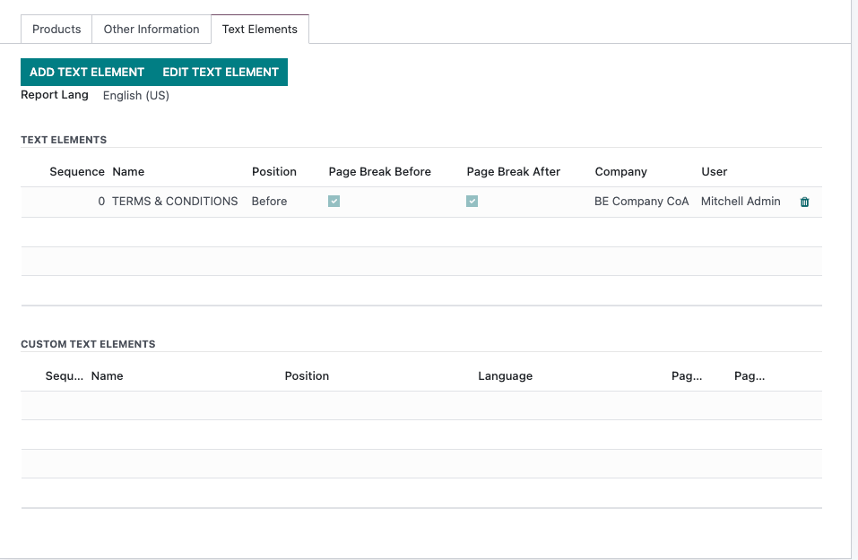

.. image:: https://img.shields.io/badge/license-AGPL--3-blue.png
   :target: https://www.gnu.org/licenses/agpl
   :alt: License: AGPL-3

=============
Text Elements
=============

.. line-block::
  This module allows to add text elements on PDF documents.
  These text elements can be static or dynamic (e.g [[partner_id.ref]] or [[partner_id.image_1920]])
  These text elements can be defined as default and then automatically added on documents and even edited for a specific document.

Warning:
--------
This module is only a technical module containing the logic for submodules (See text_element_sale for example)

Usage
=====

See `video here <./static/description/usage.mp4>`_
